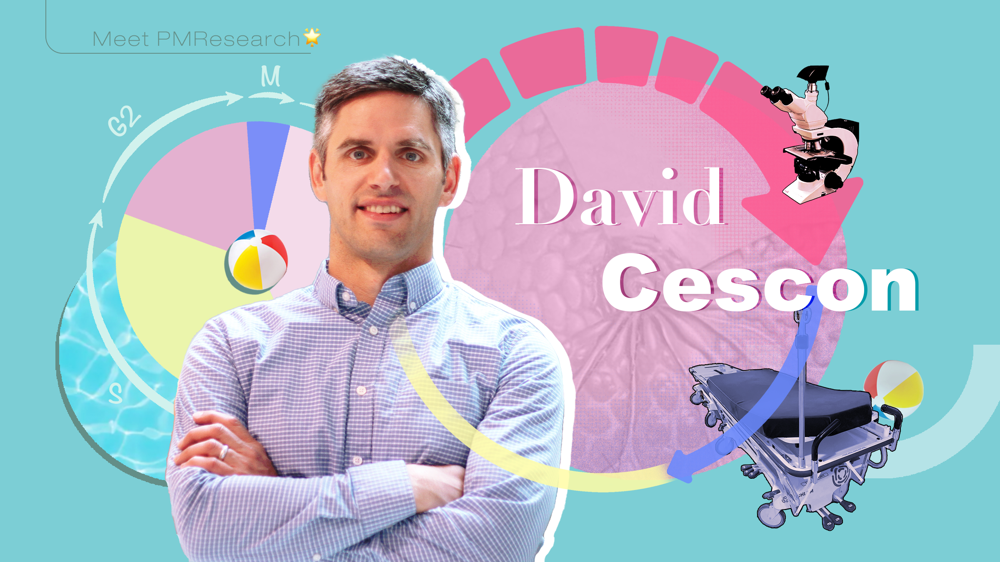
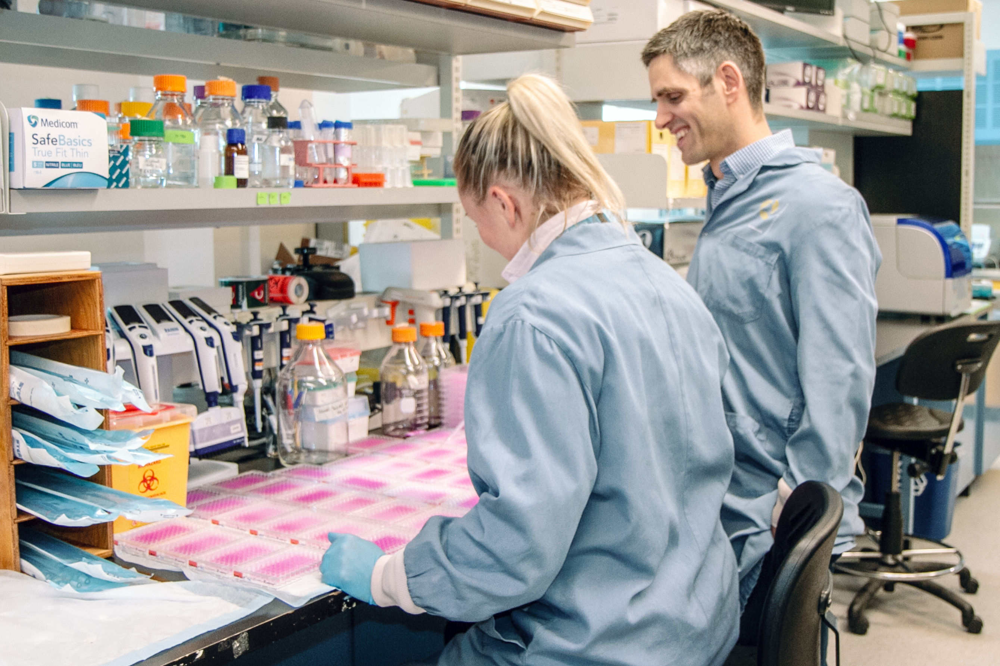

# Mission and Objective

{: align=left height=50% width=50% }
As a breast medical oncologist and clinician scientist at the Princess Margaret Cancer Centre, Dave Cescon's research integrates laboratory and clinical studies, focused on the identification of breast cancer therapeutic vulnerabilities and determinants of drug response and resistance. Leveraging pre-clinical model platforms and genomic tools, including liquid biopsy, the overarching goal of our work is to advance the delivery of precision therapy to improve breast cancer outcomes through both prevention and treatment of metastatic disease.

{: align=middle height=50% width=50% }
